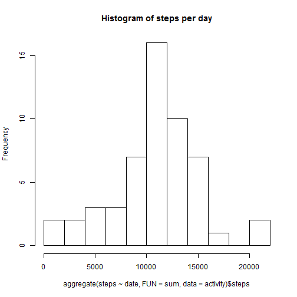
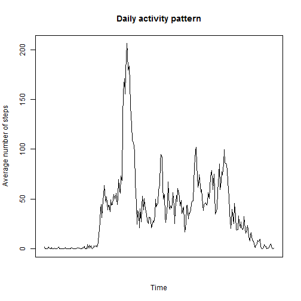

# Reproducible Research: Peer Assessment 1

## Loading and preprocessing the data
Loading the data using read.csv():


```r
activity <- read.csv("~/GitHub/RepData_PeerAssessment1/activity.csv")
```


## What is mean total number of steps taken per day?
This is a histogram of the total number of steps taken per day.
The aggregate function with the arguments `FUN = sum` and the formula 
`steps ~ date` sums up all steps taken during a day and outputs a data frame
with the columns "date" and "steps". I subset the data frame using `$steps` and
plot the histogram.

```r
hist(aggregate(steps ~ date, FUN = sum, data = activity)$steps, breaks = 10, 
    main = "Histogram of steps per day")
```

 


The mean number of steps taken per day is 
1.0766 &times; 10<sup>4</sup>
while the median is 
10765.

Code:

```r
mean(aggregate(steps ~ date, FUN = sum, data = activity)$steps, na.rm = T)
```

```
## [1] 10766
```

```r
median(aggregate(steps ~ date, FUN = sum, data = activity)$steps, na.rm = T)
```

```
## [1] 10765
```


## What is the average daily activity pattern?
Again, I use the aggregate function. This time the appropriate formula is
`steps ~ interval`. 

Note that the units on the x-axis have been removed
since by default the index would have been displayed which relates to the 
number of the 5 minute interval but not the time. Plotting the whole data frame
leads to a distortion as there are only 60 minutes in an hour and subsequently
the x values are not equally spaced.

It would have been possible to plot the time of the day, too, but that would 
have required converting the data into a time series which was not the task
(the task was to use `type = "l"`).

```r
plot(aggregate(steps ~ interval, FUN = mean, data = activity)$steps, type = "l", 
    xaxt = "n", main = "Daily activity pattern", xlab = "Time", ylab = "Average number of steps")
```

 


> Which 5-minute interval, on average across all the days in the dataset, 
> contains the maximum number of steps?


```r
data <- aggregate(steps ~ interval, FUN = mean, data = activity)
data[which(data$steps == max(data$steps)), ]
```

```
##     interval steps
## 104      835 206.2
```

```r
rm(data)
```


The interval 835 (= 08:35) contains the maximum average number of steps (206).

## Imputing missing values

```r
sum(is.na(activity$steps))
```

```
## [1] 2304
```

The total number of missing values is 2304.

For imputing the missing values I chose the strategy to replace the NAs by 
the mean of the respective 5 minute interval. This corresponds to the plot above.
First, those mean values have to be computed and stored:

```r
mean_values <- aggregate(steps ~ interval, FUN = mean, data = activity)
```


Next, I loop over all rows of the data frame (i) to find missing values
and replace missing values by the appropriate mean value. That value is 
determined by looking at the interval during which the observation is missing.
The mean values are in the data frame mean_values. Since the step count is an
integer the mean values are rounded. The new dataset is activity2.


```r
activity2 <- activity
for (i in 1:nrow(activity2)) {
    if (is.na(activity2[i, 1])) {
        # Which interval does the missing value belong to?
        int_nr <- activity2[i, "interval"]
        
        # Store replacement value in the object replacement
        replacement <- mean_values[mean_values$interval == int_nr, ]
        # Round mean because steps is an integer
        replacement <- round(replacement$steps)
        
        # Replace NA by replacement
        activity2[i, 1] <- replacement
        rm(int_nr, replacement)  # clean up
    }
}

# Show some rows of the resuting data frame. These were all NA before:
activity2[109:130, ]
```

```
##     steps       date interval
## 109   143 2012-10-01      900
## 110   124 2012-10-01      905
## 111   109 2012-10-01      910
## 112   108 2012-10-01      915
## 113   104 2012-10-01      920
## 114    96 2012-10-01      925
## 115    66 2012-10-01      930
## 116    45 2012-10-01      935
## 117    25 2012-10-01      940
## 118    39 2012-10-01      945
## 119    35 2012-10-01      950
## 120    21 2012-10-01      955
## 121    41 2012-10-01     1000
## 122    27 2012-10-01     1005
## 123    42 2012-10-01     1010
## 124    53 2012-10-01     1015
## 125    39 2012-10-01     1020
## 126    51 2012-10-01     1025
## 127    44 2012-10-01     1030
## 128    37 2012-10-01     1035
## 129    35 2012-10-01     1040
## 130    28 2012-10-01     1045
```


Next, let's check the differences between activity and activity2 which contains
the imputed values:


```r
hist(aggregate(steps ~ date, FUN = sum, data = activity2)$steps, breaks = 10, 
    main = "Histogram of steps per day (missing values replaced)")
```

 


The mean number of steps taken per day using activity2 is 
1.0766 &times; 10<sup>4</sup>
while it was 
1.0766 &times; 10<sup>4</sup>
before.
The median using activity2 is 
1.0762 &times; 10<sup>4</sup>
while it was 
10765
using the original data.

Code:

```r
mean(aggregate(steps ~ date, FUN = sum, data = activity2)$steps)
```

```
## [1] 10766
```

```r
median(aggregate(steps ~ date, FUN = sum, data = activity2)$steps)
```

```
## [1] 10762
```


Imputing data leads to a higher mean (only a little difference, no difference 
when rounded) and a lower median. 
A lower variance is
apparent when comparing the histograms. In activity2 there is a stronger
concentration of observations around the mean of the distribution (note the 
different y-axis limits).

## Are there differences in activity patterns between weekdays and weekends?
Task:
> Make a panel plot containing a time series plot (i.e. type = "l") of 
> the 5-minute interval (x-axis) and the average number of steps taken, 
> averaged across all weekday days or weekend days (y-axis).

I loop over all rows, determine the day, determine if the day is a weekday or 
weekend and store the result in a new factor variable week.


```r
week <- rep(NA, times = nrow(activity2))
for (i in 1:nrow(activity2)) {
    day <- as.POSIXlt(activity2[i, "date"])$wday
    # 0 means sunday, 6 means saturday
    if (day == 0 | day == 6) 
        week[i] <- "weekend" else week[i] <- "weekday"
}
week <- factor(week)  # convert to factor
activity2 <- cbind(activity2, week)  # merge
str(activity2)
```

```
## 'data.frame':	17568 obs. of  4 variables:
##  $ steps   : num  2 0 0 0 0 2 1 1 0 1 ...
##  $ date    : Factor w/ 61 levels "2012-10-01","2012-10-02",..: 1 1 1 1 1 1 1 1 1 1 ...
##  $ interval: int  0 5 10 15 20 25 30 35 40 45 ...
##  $ week    : Factor w/ 2 levels "weekday","weekend": 1 1 1 1 1 1 1 1 1 1 ...
```


Then I calculate the means of the intervals split by the factor variable week
using tapply. Subsequently melt reformats the data so that there is an 
additional column "week" containing "weekday" or "weekend". I use ggplot to
plot the data and give the original intervals on the x-axis this time for 
better interpretability.


```r
library(reshape2)
library(ggplot2)
plotdata <- with(activity2, tapply(steps, INDEX = list(interval, week), mean))
plotdata <- melt(plotdata, id = c("weekday", "weekend"), varnames = c("interval", 
    "week"), value.name = "steps")
head(plotdata)
```

```
##   interval    week   steps
## 1        0 weekday 2.28889
## 2        5 weekday 0.40000
## 3       10 weekday 0.15556
## 4       15 weekday 0.17778
## 5       20 weekday 0.08889
## 6       25 weekday 1.57778
```

```r

ggplot(plotdata, aes(interval, steps)) + geom_line() + facet_wrap(~week, nrow = 2)
```

 


As can be seen, the person gets up a bit later on weekends. There is no sudden
increase in steps at a few minutes past 5. Additionally, the activity is more 
evenly distributed.
