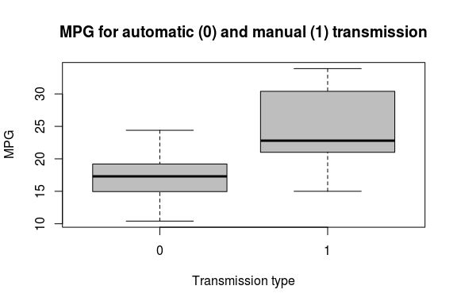
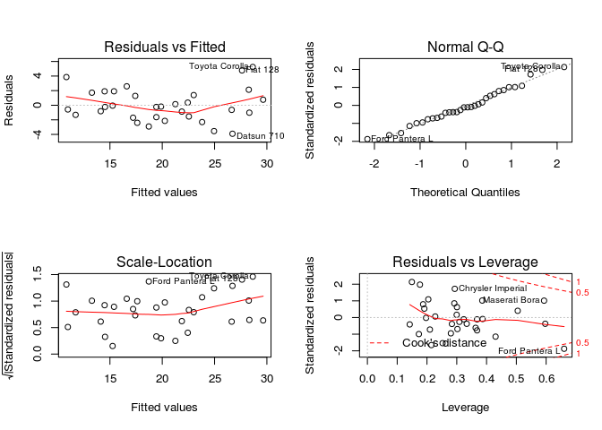
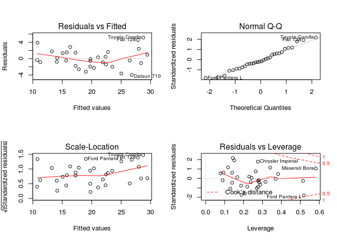

# The influence of transmission types on miles per gallon
**Executive summary:** On average, cars with manual transmission run 7.25 additional miles per gallon (MPG). When considering other influences on MPG like weight and horsepower some of the additional miles can be attributed to the fact that cars with manual transmission are generally likely to save fuel due to their other features. After controlling for those, cars with manual transmission still run 2.05 miles per gallon more, on average and holding all other characteristics fixed. The effect is not statistically different from zero, though.

## Exploring the data
The data set consists of 32 observations of 11 variables, namely miles per gallon, the number of cylinders, the displacement, the horsepower, the rear axle ratio, the weight, the quarter mile time, V/S (i.e. engine type), the transmission type, the number of forward gears and the number of carburetors. The cars in the sample were all built in 1973 or 1974. These cars reach on average ``20.090625`` miles per gallon.

Regarding the difference between cars with automatic and manual transmission calculating the mean MPG shows that cars with manual transmission run on average 7.25 miles per gallon more. Furthermore the two groups do not overlap very much (see Appendix A for a boxplot) and the coefficient on the transmission type (am) is highly significant in a simple regression model (not shown here). This observation serves as a first impression concerning the influence of the transmission type. To make a more reliable statement about the size of the effect a multivariate regression model is estimated in the next chapter.

## Controlling for additional influences on MPG using a multivariate regression model
As mentioned before, the data set includes various other variables which can be assumed to influence MPG. It follows that due to omitting relevant variables the estimate of a 7.25 MPG difference between manual and automatic transmission is biased. Actually, all variables in the data set have considerable correlations with MPG:


```
##        mpg        cyl       disp         hp       drat         wt 
##  1.0000000 -0.8521620 -0.8475514 -0.7761684  0.6811719 -0.8676594 
##       qsec         vs         am       gear       carb 
##  0.4186840  0.6640389  0.5998324  0.4802848 -0.5509251
```

Accordingly, a model using all other variables except for qsec as predictors for MPG was estimated. The 1/4 mile time was excluded as it can be expected to be determined by other variables like horsepower and does not directly influence MPG. This is confirmed by high correlations among these variables.


```
## 
## Call:
## lm(formula = mpg ~ cyl + disp + hp + drat + wt + vs + am + gear + 
##     carb, data = mtcars)
## 
## Residuals:
##     Min      1Q  Median      3Q     Max 
## -3.9116 -1.5674 -0.2339  1.4742  5.2483 
## 
## Coefficients:
##              Estimate Std. Error t value Pr(>|t|)  
## (Intercept) 28.514875  11.992102   2.378   0.0265 *
## cyl         -0.433807   1.010821  -0.429   0.6720  
## disp         0.007608   0.017216   0.442   0.6629  
## hp          -0.024133   0.021769  -1.109   0.2796  
## drat         0.720339   1.643997   0.438   0.6655  
## wt          -2.636203   1.642528  -1.605   0.1228  
## vs           1.181162   1.970789   0.599   0.5551  
## am           1.887310   1.989726   0.949   0.3532  
## gear         0.519607   1.497197   0.347   0.7318  
## carb        -0.449539   0.803027  -0.560   0.5813  
## ---
## Signif. codes:  0 '***' 0.001 '**' 0.01 '*' 0.05 '.' 0.1 ' ' 1
## 
## Residual standard error: 2.666 on 22 degrees of freedom
## Multiple R-squared:  0.8611,	Adjusted R-squared:  0.8043 
## F-statistic: 15.16 on 9 and 22 DF,  p-value: 1.658e-07
```

This model achieves a very high R-squared of 86%, however all coefficients are insignificant. The effect of am on mpg is estimated at 1.89 miles per gallon, i.e. a car with manual transmission runs additional 1.89 miles per gallon on average, holding all other variables fixed. 

The diagnostic plots show an obsevation with high leverage, see Appendix C. Furthermore, high correlations among the explanatory variables could be seen in a pairs plot (Appendix B). Therefore the variance inflation factors (VIF) are considered in order to check whether these correlations inflate the standard errors of the variables and lead to high p-values.


```
##       cyl      disp        hp      drat        wt        vs        am 
## 14.214653 19.858173  9.716495  3.370162 11.266058  4.303598  4.299664 
##      gear      carb 
##  5.322341  7.337960
```

Very high VIFs are found for the number of cylinders (cyl), the displacement (disp), and the weight (wt). These variables are all highly correlated with each other, see Appendix B. Of these variables, only weight is kept in the model. This model was estimated and the VIFs checked again.


```r
fit2 <- lm(mpg ~ hp + drat + wt + vs + am  + gear + carb, data = mtcars)
summary(fit2)
```

```
## 
## Call:
## lm(formula = mpg ~ hp + drat + wt + vs + am + gear + carb, data = mtcars)
## 
## Residuals:
##     Min      1Q  Median      3Q     Max 
## -3.9954 -1.5199 -0.4047  1.4574  5.1519 
## 
## Coefficients:
##             Estimate Std. Error t value Pr(>|t|)   
## (Intercept) 24.44221    7.57395   3.227   0.0036 **
## hp          -0.02147    0.01380  -1.556   0.1328   
## drat         0.93076    1.52131   0.612   0.5464   
## wt          -2.07656    1.03497  -2.006   0.0562 . 
## vs           1.31784    1.45607   0.905   0.3744   
## am           2.04602    1.87751   1.090   0.2866   
## gear         0.73007    1.35360   0.539   0.5946   
## carb        -0.70001    0.58536  -1.196   0.2434   
## ---
## Signif. codes:  0 '***' 0.001 '**' 0.01 '*' 0.05 '.' 0.1 ' ' 1
## 
## Residual standard error: 2.568 on 24 degrees of freedom
## Multiple R-squared:  0.8594,	Adjusted R-squared:  0.8184 
## F-statistic: 20.96 on 7 and 24 DF,  p-value: 8.87e-09
```

```r
vif(fit2) 
```

```
##       hp     drat       wt       vs       am     gear     carb 
## 4.207016 3.109237 4.819161 2.530943 4.124605 4.686962 4.200759
```

This time the intercept and the coefficient on weight are significantly different from zero at about 95% confidence (please refer to the table for exact p-values). The coefficient on am changes to 2.05 and the R-squared is virtually as high as before. All VIFs are quite low and the diagnostic plots show no obvious problems with this specification, see Appendix D. It could perhaps be suspected that there is heteroscedasticity as the variance of the residuals seems to appreciate with larger fitted values. A white test of constant variance fails to reject this null hypothesis, though (not shown here). 

Thus, accepting this model as the best of the considered models, the MPG advantage of manual transmission over automatic transmission is estimated at 2.05 miles per gallon, all other variables fixed. It should be noted though that the coefficient is not significantly different from zero, so after controlling for the other influences it cannot be concluded with certainty that manual transmission leads to a higher MPG.


## Appendix
## Appendix A
 

## Appendix B
 

## Appendix C 
 

## Appendix D
 
