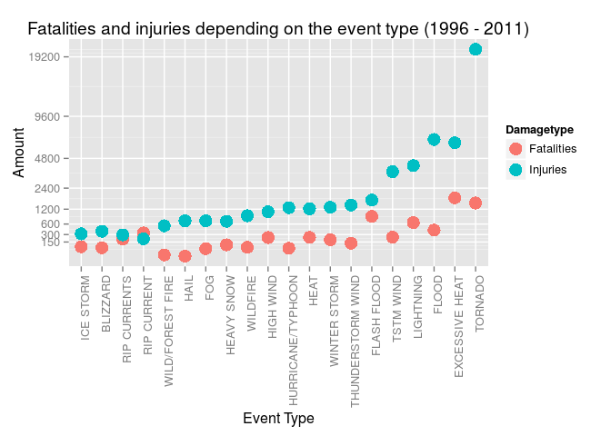
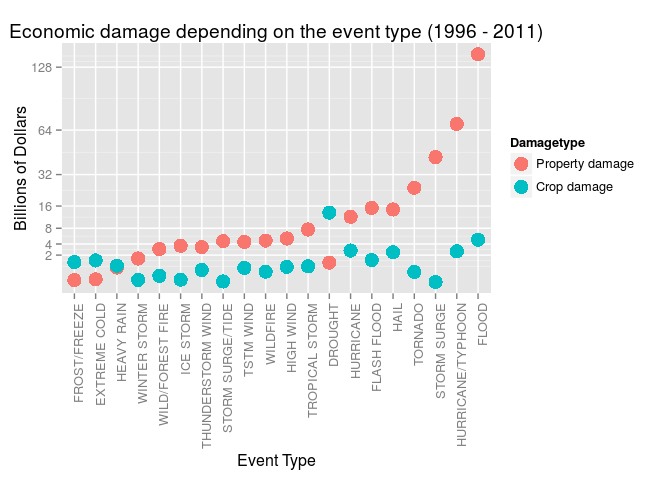

# Tornadoes and floods dealt the largest damage to the economy and health respectively - USA, 1996 - 2011

## Synopsis
This document briefly analyzes the impact of different weather events that occurred
in the United States between 1996 and 2011. More specifically, the economic
damage as represented by the damage to crops and property and the damage to population 
health as represented by the number of injuries and fatalities are considered. 
Since the purpose of the analysis is to help understand differences in
weather events, the events are compared based on the results of the damage analysis. 
By far the largest harm to population health was done by tornadoes. A second 
group of events that are relatively harmful to health is comprised of Excessive Heat,
Thunderstorm Wind, Flood, and Lightning. Regarding total economic damage the top causes are floods, hurricanes and storm surges. The same is true with respect to property damage. The top cause of crop damage is drought.

## Data processing

```r
# Functions and libraries
library(ggplot2)
library(plyr)
library(reshape2)
library(knitr)
```

Downloading and reading in the data (source: NOAA):


```r
if (!file.exists("stormdata.csv.bz2")){
      download.file(url = "http://d396qusza40orc.cloudfront.net/repdata%2Fdata%2FStormData.csv.bz2", destfile = "stormdata.csv.bz2")
      }

# unzip
if (!file.exists("stormdata.csv")){
      library(R.utils)
      bunzip2("stormdata.csv.bz2", destname = "stormdata.csv", remove=F)
      }
```

```
## Loading required package: R.oo
## Loading required package: R.methodsS3
## R.methodsS3 v1.7.0 (2015-02-19) successfully loaded. See ?R.methodsS3 for help.
## R.oo v1.19.0 (2015-02-27) successfully loaded. See ?R.oo for help.
## 
## Attaching package: 'R.oo'
## 
## The following objects are masked from 'package:methods':
## 
##     getClasses, getMethods
## 
## The following objects are masked from 'package:base':
## 
##     attach, detach, gc, load, save
## 
## R.utils v2.1.0 (2015-05-27) successfully loaded. See ?R.utils for help.
## 
## Attaching package: 'R.utils'
## 
## The following object is masked from 'package:utils':
## 
##     timestamp
## 
## The following objects are masked from 'package:base':
## 
##     cat, commandArgs, getOption, inherits, isOpen, parse, warnings
```

```r
stormdata <- read.csv("stormdata.csv")
```

As stated by the NOAA, weather events of all types were recorded only since 1996,
see http://www.ncdc.noaa.gov/stormevents/details.jsp. During most of the years
in the data set only tornadoes were recorded. Thus, all years prior to 1996 
will be dropped in order to avoid the biasing of subsequent estimates.


```r
# Format date variable
stormdata$BGN_DATE <- as.character(stormdata$BGN_DATE)
# Function to select only the date part
f <- function(x) strsplit(x, split = " ")[[1]][1]
stormdata$BGN_DATE <- sapply(stormdata$BGN_DATE, FUN = f); rm(f)
stormdata$BGN_DATE <- as.Date(stormdata$BGN_DATE, format = "%m/%d/%Y")
stormdata$year <- format(stormdata$BGN_DATE, format = "%Y")
# Keep only if event from 1996 or later
stormdata <- stormdata[which(stormdata$year >= 1996), ]
```

Since only events that caused injuries, fatalities or damage are relevant here, other events can be dropped from the data set.


```r
nofatalities <- which(stormdata$FATALITIES == 0)
noinjuries <- which(stormdata$INJURIES == 0)
nocropdmg <- which(stormdata$CROPDMG == 0)
nopropdmg <- which(stormdata$PROPDMG == 0)

drop <- Reduce(intersect, list(nofatalities, noinjuries, nocropdmg, nopropdmg))
rm(nofatalities, noinjuries, nocropdmg, nopropdmg)
```

Of 653530 records 452212 can be dropped.


```r
stormdata <- stormdata[-drop, ]; rm(drop)
```

For economic damage the PROPDMGEXP (exponent) variable needs to be taken into account. 
The same applies for crop damage and the CROPDMGEXP variable. The damage has to be multiplied accordingly (e.g. multiply by 1000 if EXP = K).


```r
# Calculate fatalities and injuries per event type
fatalities <- tapply(X = stormdata$FATALITIES, INDEX = stormdata$EVTYPE, FUN = sum)
fatality_evtypes <- names(fatalities)
injuries <- tapply(X = stormdata$INJURIES, INDEX = stormdata$EVTYPE, FUN = sum)

# Create a multiplier variable for property damage, because it is a character
# in the original data
stormdata$propfactor <- 1
expcodes <- c("h", "H", "k", "K", "m", "M", "b", "B")
exponents <- c(100, 100, 1000, 1000, 1000000, 1000000, 1000000000, 1000000000)
for (i in seq_along(expcodes)){
      index <- which(stormdata$PROPDMGEXP == expcodes[i])
      stormdata$propfactor[index] <- exponents[i]
      }

# The same for crop damage
stormdata$cropfactor <- 1
expcodes <- c("h", "H", "k", "K", "m", "M", "b", "B")
exponents <- c(100, 100, 1000, 1000, 1000000, 1000000, 1000000000, 1000000000)
for (i in seq_along(expcodes)){
      index <- which(stormdata$CROPDMGEXP == expcodes[i])
      stormdata$cropfactor[index] <- exponents[i]
      }
rm(expcodes, exponents, i, index)

# Damage in billions of dollars
stormdata$propertydamage <- (stormdata$PROPDMG * stormdata$propfactor) / 1e+09
stormdata$cropdamage <- (stormdata$CROPDMG * stormdata$cropfactor) / 1e+09
propertydmg <- tapply(X = stormdata$propertydamage, INDEX = stormdata$EVTYPE, FUN = sum)
cropdmg <- tapply(X = stormdata$cropdamage, INDEX = stormdata$EVTYPE, FUN = sum)

# Calculate totals in order to display percentages of totals later
injuriessum <- sum(stormdata$INJURIES)
fatalitiessum <- sum(stormdata$FATALITIES)
cropdmgsum <- sum(stormdata$cropdamage)
propertydmgsum <- sum(stormdata$propertydamage)
```

The event types should belong to 48 standard types, see the National Weather Service Storm Data Documentation, page 6. There are much more in the data:


```r
stormdata$EVTYPE <- as.character(stormdata$EVTYPE)
length(unique(stormdata$EVTYPE))
```

```
## [1] 222
```

In the subset of events after 1996 there are 222 different types. Without domain knowledge it would be problematic to categorize all the rare events as one of the standard types, so this attempt was not made. However, among the most common events are "THUNDERSTORM WIND" and "TSTM WIND" which seem to be the same which is why all event types including the term "TSTM WIND" will be categorized as "THUNDERSTORM WIND". The same applies for "WILDFIRE" / "WILD/FOREST FIRE" and "RIP CURRENT" / "RIP CURRENTS".


```r
tstm_index <- grep(pattern = "TSTM WIND", x = stormdata$EVTYPE)
stormdata$EVTYPE[tstm_index] <- "THUNDERSTORM WIND"
rm(tstm_index)

stormdata$EVTYPE[stormdata$EVTYPE == "RIP CURRENTS"] <- "RIP CURRENT"

stormdata$EVTYPE[stormdata$EVTYPE == "WILD/FOREST FIRE"] <- "WILDFIRE"
```


## Results
After this reformatting the top 20 event types ordered by number of occurrences from 1996 until 2011 are the following:


```r
tabledata <- head(sort(table(stormdata$EVTYPE), decreasing = T), 20)
tabledata <- melt(tabledata)
colnames(tabledata) <- c("Event type", "Sum of occurrences")
kable(tabledata)
```


Event type              Sum of occurrences
---------------------  -------------------
THUNDERSTORM WIND                   105479
HAIL                                 22679
FLASH FLOOD                          19011
TORNADO                              12366
LIGHTNING                            11152
FLOOD                                 9513
HIGH WIND                             5402
STRONG WIND                           3367
WINTER STORM                          1460
WILDFIRE                              1228
HEAVY RAIN                            1047
HEAVY SNOW                            1029
URBAN/SML STREAM FLD                   702
EXCESSIVE HEAT                         685
ICE STORM                              631
RIP CURRENT                            603
TROPICAL STORM                         410
WINTER WEATHER                         405
AVALANCHE                              264
DROUGHT                                258

These top 20 events represent 197691 of 201318 all recorded events in the data.

### Fatalities and injuries
In order to assess the impact of the different weather events fatalities and injuries are considered first. 


```r
# NOTE: This section was not included in the chapter on data processing 
#       because it is mainly about selecting from the processed data
# Select top causes
# At least n injuries + fatalities
suminjfat <- injuries + fatalities
suminjfat <- sort(suminjfat, decreasing = T)
suminjfat <- head(suminjfat, 20)
# Which are the top 20 events by sum of injuries and fatalities?
selected_events <- names(suminjfat)

# Select from injuries and fatalities data
injuries2 <- injuries[names(injuries) %in% selected_events] 
fatalities2 <- fatalities[names(fatalities) %in% selected_events] 

# Plot fatality and injury values depending on event type
m_injuries2 <- melt(injuries2, value.name="Injuries")
m_fatalities2 <- melt(fatalities2, value.name="Fatalities")
plotdata <- merge(m_fatalities2, m_injuries2, by = "Var1")
colnames(plotdata)[1] <- "Event Type"
plotdata <- melt(plotdata, id.vars = c("Event Type"), 
                 value.name = "Amount", 
                 variable.name = "Damagetype")

ybreaks <- 150 * 2^(0:10)
ggplot(plotdata, 
       aes(x=reorder(plotdata$`Event Type`, plotdata$Amount, FUN=sum, order=T),
           y=Amount)) + 
      geom_point(aes(colour=Damagetype), stat="identity", size=5) +
      scale_y_sqrt(breaks = ybreaks) + xlab("Event Type") +
      theme(axis.text.x = element_text(angle = 90, hjust = 1)) +
      ggtitle("Fatalities and injuries depending on the event type (1996 - 2011)")
```

 

Tornadoes caused by far the most injuries (please note the logarithmic scale). A second group of events consisting of excessive heat, flood, thunderstorm wind and lightning also caused a considerable amount of injuries. Excessive heat caused the most fatalities, followed by tornadoes. 

In general, all of the top 16 events cause more injuries than fatalities. One notable exception are flash floods which cause nearly as many fatalities as injuries so that the number of fatalities caused by flash floods is the third highest although regarding the sum of fatalities and injuries flash floods is at rank six.


```r
# Table
m_suminjfat <- melt(suminjfat)
# Calculate percentages
m_fatalities2$fatalitypercentage <- (m_fatalities2$Fatalities / fatalitiessum) * 100
m_injuries2$injurypercentage <- (m_injuries2$Injuries / injuriessum) * 100

tabledata <- join_all(list(m_fatalities2, m_injuries2, m_suminjfat), 
                      by = 'Var1', type = 'full')
colnames(tabledata) <- c("Event", "Fatalities", "...percent of total", 
                         "Injuries", "...percent of total", "Sum")
kable(tabledata[order(tabledata$Sum, decreasing = T), ], row.names = F, digits = 2)
```


Event                Fatalities   ...percent of total   Injuries   ...percent of total     Sum
------------------  -----------  --------------------  ---------  --------------------  ------
TORNADO                    1511                 17.30      20667                 35.65   22178
EXCESSIVE HEAT             1797                 20.58       6391                 11.02    8188
FLOOD                       414                  4.74       6758                 11.66    7172
LIGHTNING                   651                  7.46       4141                  7.14    4792
TSTM WIND                   241                  2.76       3629                  6.26    3870
FLASH FLOOD                 887                 10.16       1674                  2.89    2561
THUNDERSTORM WIND           130                  1.49       1400                  2.41    1530
WINTER STORM                191                  2.19       1292                  2.23    1483
HEAT                        237                  2.71       1222                  2.11    1459
HURRICANE/TYPHOON            64                  0.73       1275                  2.20    1339
HIGH WIND                   235                  2.69       1083                  1.87    1318
WILDFIRE                     75                  0.86        911                  1.57     986
HEAVY SNOW                  107                  1.23        698                  1.20     805
FOG                          60                  0.69        712                  1.23     772
HAIL                          7                  0.08        713                  1.23     720
WILD/FOREST FIRE             12                  0.14        545                  0.94     557
RIP CURRENT                 340                  3.89        209                  0.36     549
RIP CURRENTS                202                  2.31        294                  0.51     496
BLIZZARD                     70                  0.80        385                  0.66     455
ICE STORM                    82                  0.94        318                  0.55     400

### Economic damage
Economic damage is defined here as the sum of property damage and crop damage. As stated in the NOAA's documentation many of these numbers are estimates. 


```r
# NOTE: This section was not included in the chapter on data processing 
#       because it is mainly about selecting from the processed data
## Select economically most harmful events
sumdmg <- propertydmg + cropdmg
sumdmg <- sort(sumdmg, decreasing = T)
sumdmg <- head(sumdmg, 20)
# Which are the top 20 events by sum of damage?
selected_events <- names(sumdmg)

# Select from cropdmg and propertydmg data
cropdmg2 <- cropdmg[names(cropdmg) %in% selected_events] 
propertydmg2 <- propertydmg[names(propertydmg) %in% selected_events] 

# Plot fatality and injury values depending on event type
m_cropdmg2 <- melt(cropdmg2, value.name="cropdmg")
m_propertydmg2 <- melt(propertydmg2, value.name="propertydmg")
plotdata <- merge(m_propertydmg2, m_cropdmg2, by = "Var1")
colnames(plotdata) <- c("Event Type", "Property damage", "Crop damage")
plotdata <- melt(plotdata, id.vars = c("Event Type"), value.name = "Dollars", 
                 variable.name = "Damagetype")

ybreaks <- 2 * 2^(0:10)
ggplot(plotdata, 
       aes(x=reorder(plotdata$`Event Type`, plotdata$Dollars, FUN=sum, order=T), 
           y=Dollars)) + 
      geom_point(aes(colour=Damagetype), stat="identity", size=5) +
      scale_y_sqrt(breaks = ybreaks) +
      xlab("Event Type") + ylab("Billions of Dollars") +
      theme(axis.text.x = element_text(angle = 90, hjust = 1)) +
      ggtitle("Economic damage depending on the event type (1996 - 2011)")
```

 

With respect to economic damage tornadoes are less important. Floods 
caused roughly twice the damage of the second most dangerous event, hurricanes (again, please note the log scale). The vast majority of the top events inflicts a much larger damage to property than to crops. The exception here are droughts which are by far the top cause of crop damage and which caused about 13\$bn of crop damage and just 1\$bn of property damage.


```r
# Table
m_sumdmg <- melt(sumdmg)
# Calculate percentages
m_propertydmg2$fatalitypercentage <- (m_propertydmg2$propertydmg / propertydmgsum) * 100
m_cropdmg2$injurypercentage <- (m_cropdmg2$cropdmg / cropdmgsum) * 100

tabledata <- join_all(list(m_propertydmg2, m_cropdmg2, m_sumdmg), 
                      by = 'Var1', type = 'full')
colnames(tabledata) <- c("Event", "Property damage (bn USD)", "...as percent of total",
                         "Crop damage (bn USD)", "...as percent of total", "Sum")
kable(tabledata[order(tabledata$Sum, decreasing = T), ], digits = 2, row.names = F)
```


Event                Property damage (bn USD)   ...as percent of total   Crop damage (bn USD)   ...as percent of total      Sum
------------------  -------------------------  -----------------------  ---------------------  -----------------------  -------
FLOOD                                  143.94                    39.25                   4.97                    14.31   148.92
HURRICANE/TYPHOON                       69.31                    18.90                   2.61                     7.50    71.91
STORM SURGE                             43.19                    11.78                   0.00                     0.00    43.19
TORNADO                                 24.62                     6.71                   0.28                     0.82    24.90
HAIL                                    14.60                     3.98                   2.48                     7.12    17.07
FLASH FLOOD                             15.22                     4.15                   1.33                     3.84    16.56
HURRICANE                               11.81                     3.22                   2.74                     7.89    14.55
DROUGHT                                  1.05                     0.29                  13.37                    38.46    14.41
TROPICAL STORM                           7.64                     2.08                   0.68                     1.95     8.32
HIGH WIND                                5.25                     1.43                   0.63                     1.82     5.88
WILDFIRE                                 4.76                     1.30                   0.30                     0.85     5.05
TSTM WIND                                4.48                     1.22                   0.55                     1.59     5.03
STORM SURGE/TIDE                         4.64                     1.27                   0.00                     0.00     4.64
THUNDERSTORM WIND                        3.38                     0.92                   0.40                     1.15     3.78
ICE STORM                                3.64                     0.99                   0.02                     0.05     3.66
WILD/FOREST FIRE                         3.00                     0.82                   0.11                     0.31     3.11
WINTER STORM                             1.53                     0.42                   0.01                     0.03     1.54
HEAVY RAIN                               0.58                     0.16                   0.73                     2.10     1.31
EXTREME COLD                             0.02                     0.01                   1.29                     3.71     1.31
FROST/FREEZE                             0.01                     0.00                   1.09                     3.15     1.10
